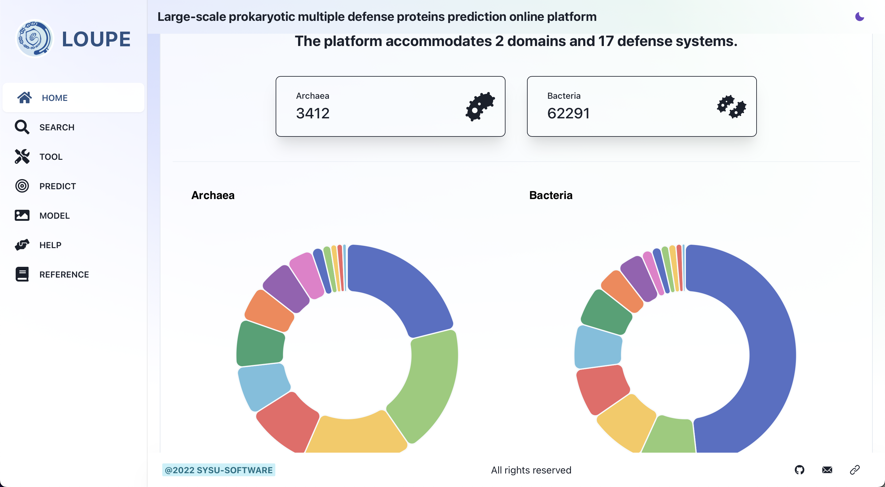
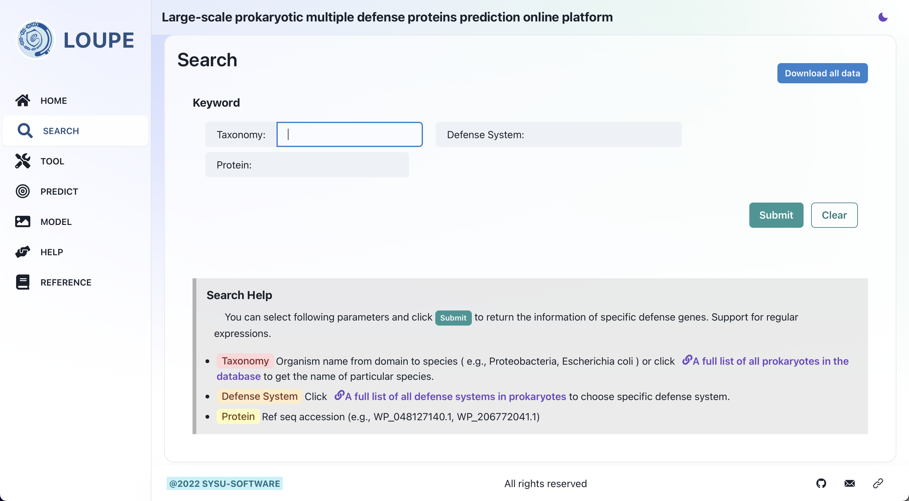
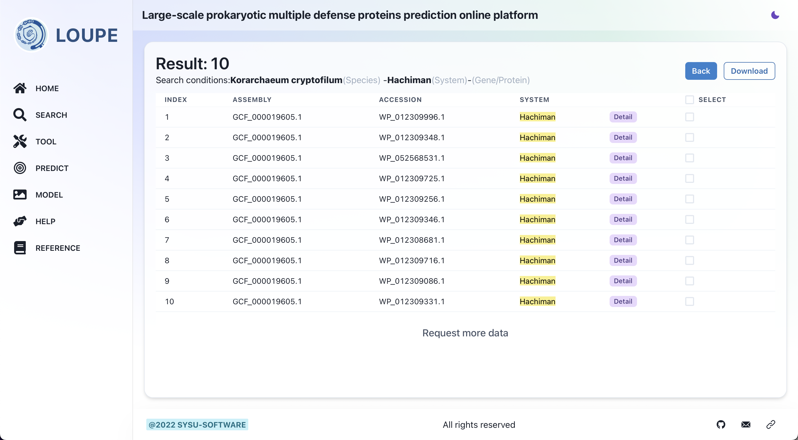
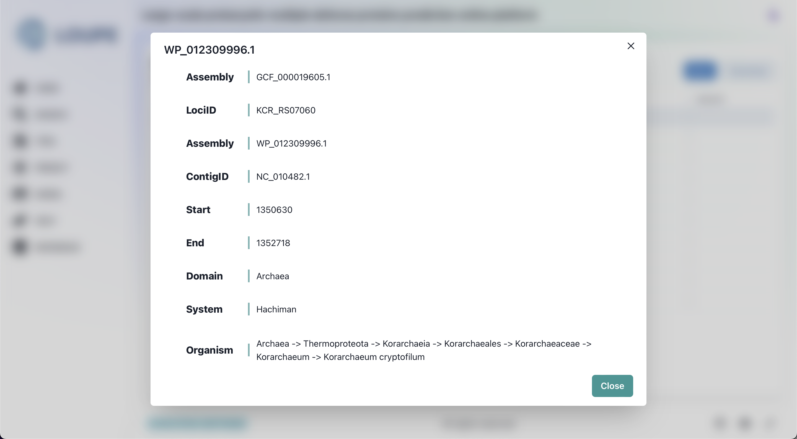
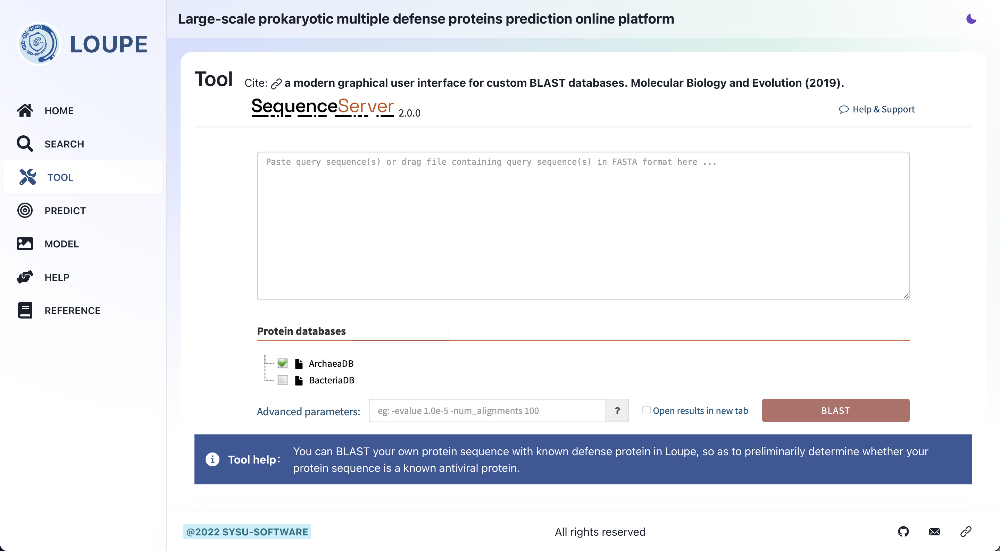
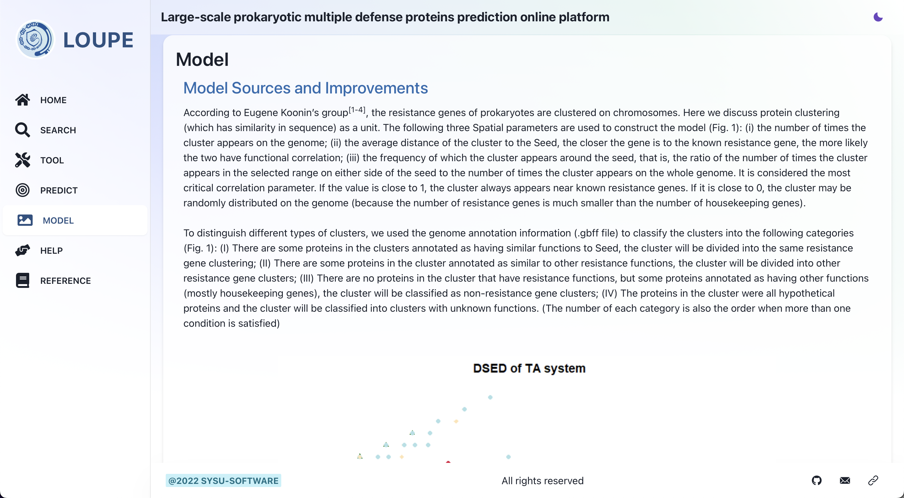
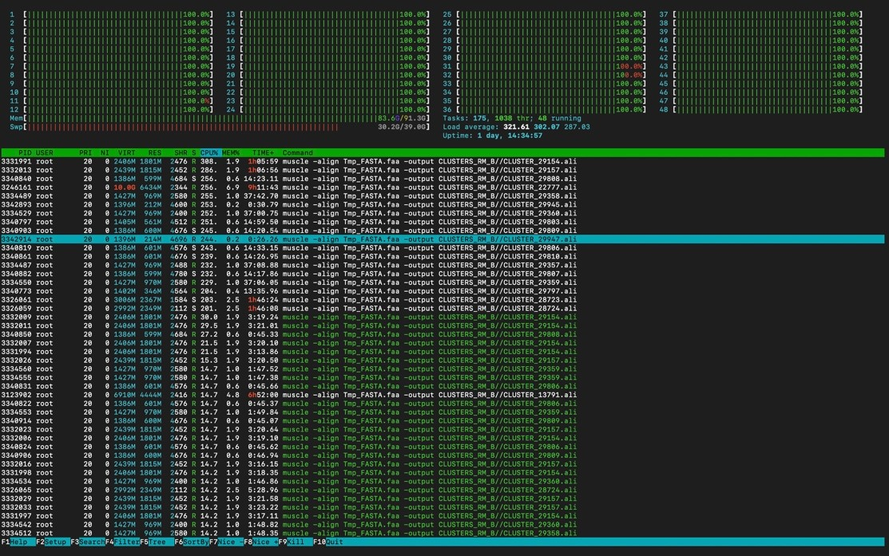

<table align="center"><tr><td align="center" width="999">

 
 
  

<h1  align="center"> iGEM SYSU-Software 2022 </h1>

<h1 align="center"> Loupe Online Platform</h1>  
<h1 align="center"> LoupeTool & LoupeRunner </h1>  

</td></tr></table>

# 🚩Introduction
​	In iGEM 2022, SYSU-Software developed an online platform, LOUPE, documenting all the known defense systems in prokaryotes; and two interrelated offline tools, LOUPERunner and LOUPETools, allowing users to search and predict defense genes in prokaryotic genomes in silico.

​	LOUPE is an online platform containing data on prokaryotic defense systems with clear visualization while allowing users to search for information with different parameters.

​	LoupeTool is a python package. You can use only a python command in Linux to run demo or process your own data. For details see [LoupeTool](https://gitlab.igem.org/2022/software-tools/sysu-software/-/tree/main/LoupeTool). You can run LoupeRunner step by step with your customized parameters. 

​	LoupeRunner is suit for debugging or for code modification to some context. For details see [LoupeRunner](https://gitlab.igem.org/2022/software-tools/sysu-software/-/tree/main/LoupeRunner).  

# ⚛︎ Software

​	We have a web app and powerful offline tools available for anyone interested in digging more defense genes out of prokaryotes.

## I. Online Platform – <a href="http://sysu-software.com">LOUPE</a>

​	LOUPE online platform gathered all the known prokaryote defense systems and visualized the data for users to find the systems or genes they are interested in.

### (1) Homepage

​	The homepage shows the visualization of prokaryotic defense systems collected by our database.

​	

Homepage of LOUPE
 

### (2) Search page

​	The search page enables users to search for the prokaryotic defense genes data they want by selecting one or more of the parameters in "Taxonomy," "Defense System," and "Protein" and downloading the data locally for further analysis.

The Search page of LOUPE
 

The Search Result Example
 

The Search Result Details
 

### (3) Tool interface

​	Here we built a small online blast database, which contains the protein sequences of prokaryotic resistance genes we collected. If users have an unknown protein sequence, they can try to perform BLAST alignment on this platform.

The Tool interface of LOUPE
 

### (4) Model Interface

​	We briefly describe how the data on our Predict page is generated. We have mined potential resistance genes such as Abi, Cas, and RM from archaeal genomes based on the concept of Defense Island. 

The Model page of LOUPE
 

## II. Offline Tools – LOUPERunner&LOUPETool

​	We have developed two interrelated offline tools: LoupeRunner and LoupeTool, to help researchers search and predict defense genes in genomes of prokaryotes in silico. In both tools, after inputting sequences (Seed) and assigning the desired defense systems, users can acquire a list of accession (.lst) and corresponding protein sequence (.faa) of each cluster with unknown functions predicted as the assigned defense systems.

​	The user guide, which contains a step-by-step tutorial with an example, is already written on GitLab. And the overall prediction process is also thoroughly described in Project Description and Engineer Success. You can check there for details.

### (1) LOUPETool

​	LOUPETool is a python package that can be used only with a python command in Linux to run demos or process users’ data. Although it might not provide many customized options, it’s genuinely convenient and still very powerful.

### (2) LoupeRunner

​	LOUPERunner is more of a powerful tool allowing users to execute the program with their customized parameters and therefore more space for customization, and it’s suited for debugging or for code modification to some context. It can be viewed as an integrated python package version of LoupeRunner. However, for processing large seeds by executing LOUPETool, you may have to wait for a longer time, which is contingent on your CPU core number (some bottleneck steps in LOUPETool are optimized by parallelization and the performance is positively correlated with the CPU core number). Therefore, we strongly recommend you execute LoupeTool on a high-performance computing platform (HPC).

48 CPU cores usage in a high-performance computing platform when processing bulk data during the paralleled period.
 

# 👥 Authors and acknowledgment

🌟Thanks to [Jingyun Huang](https://gitlab.igem.org/Maxwell), [Siduo Li](https://gitlab.igem.org/SiduoLi), [Zhongchun Zheng](https://gitlab.igem.org/zzc), [Tianxing Yang](https://gitlab.igem.org/P1atforM) and [Hongxin Xu](https://gitlab.igem.org/hungyam) for developing these fantastic software tools.

